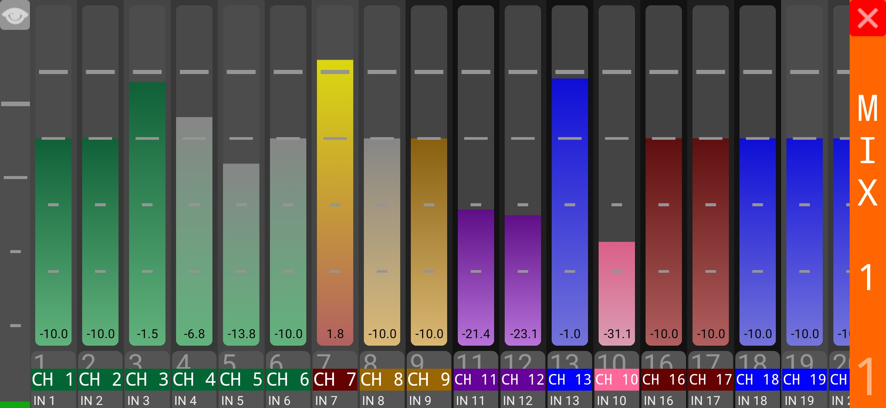

# TouchFaders app
OSC Android app for TouchFaders MIDI, using zerOSConf

## What's this for?
See the main repo for this project, [TouchFaders MIDI](https://github.com/theonlytechnohead/TouchFaders_MIDI) for more details

## Where do it get this?
It's available on the [Play Store](https://play.google.com/store/apps/details?id=net.ddns.anderserver.touchfaders)!  
Due to security issues (and because it'd be a pain for me to manage right now), there is no direct APK download.  
Instead, please clone the whole repository, and use Android Studio to generate your own APK and install it on your device.  
